# Projeto de Interface

Pré-requisitos: <a href="2-Especificação do Projeto.md"> Documentação de Especificação</a>

Visão geral da interação do usuário pelas telas do sistema e protótipo interativo das telas com as funcionalidades que fazem parte do sistema (wireframes), tanto da versão web como para a versão mobile.

 Apresente as principais interfaces da plataforma. Discuta como ela foi elaborada de forma a atender os requisitos funcionais, não funcionais e histórias de usuário abordados nas <a href="2-Especificação do Projeto.md"> Documentação de Especificação</a>.

## Visão Geral das Interfaces

A plataforma **Bora lá Eventos** atende dois perfis de usuários: frequentadores, que buscam descobrir e acompanhar eventos próximos, e organizadores, que precisam divulgar e gerenciar sua agenda. Esse dualismo guiou as decisões de design, resultando em interfaces distintas para cada contexto — um painel de gestão voltado para web, onde organizadores criam e administram eventos, e uma experiência mobile-first para frequentadores explorarem eventos no dia a dia.

As telas de autenticação (login e registro) foram projetadas de forma simples e direta, com separação clara entre os tipos de conta no fluxo de cadastro. Uma vez autenticado, o frequentador acessa um feed de eventos ordenado por data e relevância (RF-003), com opções de busca por nome, categoria e filtro por geolocalização. A visualização em mapa complementa a listagem, atendendo usuários que preferem explorar eventos pela proximidade geográfica.

A página de detalhes do evento centraliza as informações relevantes — data, hora, local e descrição — e disponibiliza as funcionalidades de curtida e comentários, permitindo interação entre os usuários e fornecendo ao organizador indicadores de engajamento do público.

Para os organizadores, o painel de gestão oferece uma visão consolidada dos seus eventos, com interfaces dedicadas para criação, edição e exclusão, e gerenciamento do perfil do estabelecimento. O painel foi desenvolvido prioritariamente para web, onde o espaço de tela favorece a administração de múltiplos eventos.

Todas as interfaces foram elaboradas seguindo os requisitos não funcionais de responsividade e desenvolvidas com Next.js e TypeScript, garantindo consistência visual e desempenho adequado em diferentes dispositivos e tamanhos de tela.

## Diagrama de Fluxo

O diagrama apresenta o estudo do fluxo de interação do usuário com o sistema interativo e  muitas vezes sem a necessidade do desenho do design das telas da interface. Isso permite que o design das interações seja bem planejado e gere impacto na qualidade no design do wireframe interativo que será desenvolvido logo em seguida.

O diagrama de fluxo pode ser desenvolvido com “boxes” que possuem internamente a indicação dos principais elementos de interface - tais como menus e acessos - e funcionalidades, tais como editar, pesquisar, filtrar, configurar - e a conexão entre esses boxes a partir do processo de interação. Você pode ver mais explicações e exemplos https://www.lucidchart.com/blog/how-to-make-a-user-flow-diagram.

- Fluxograma: Acesso ao sistema - Página inicial, Fazer Login, Criar conta, Tela de login/registro
  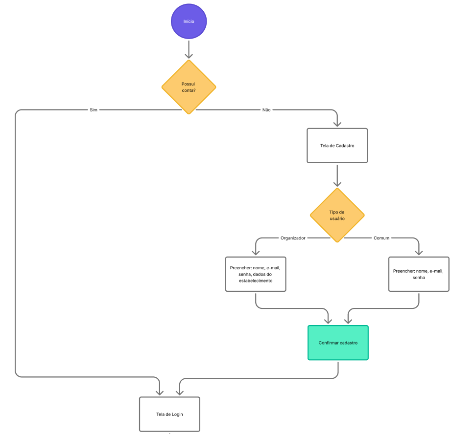

- Fluxograma: Fluxo de Registro Completo - Criação de conta com validações (email, confirmação) e seleção entre usuário comum e organizador
  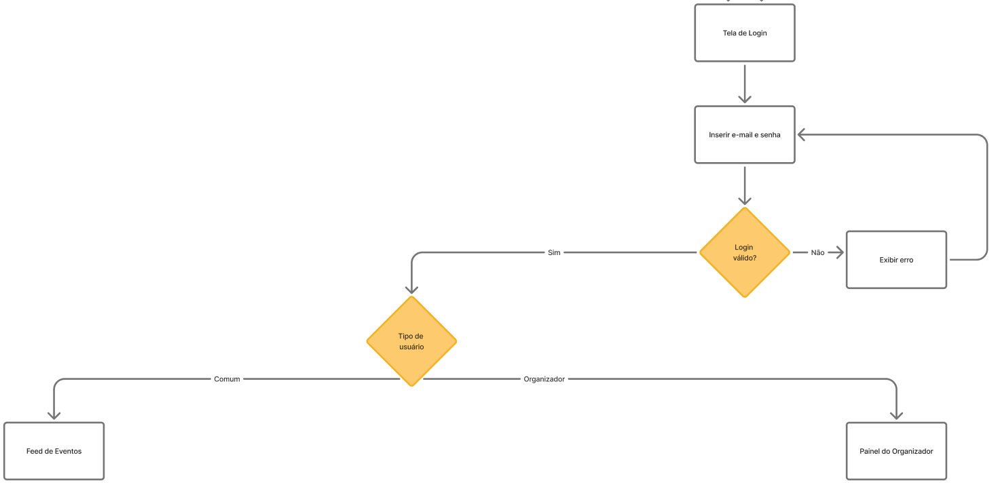

- Fluxograma: Gerenciamento de perfil - Editar dados pessoais do usuário e editar informações da organização
  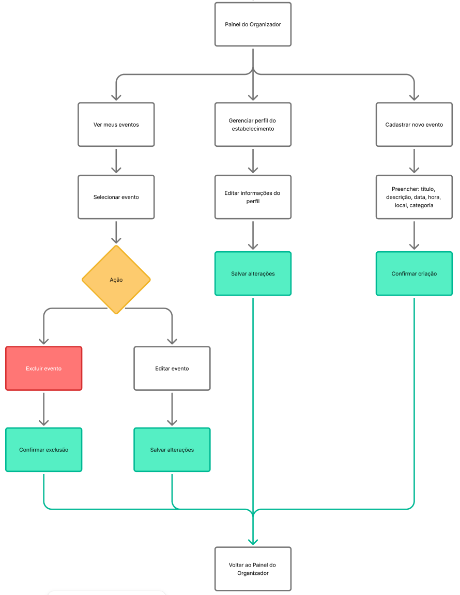

- Fluxograma: Interação com eventos - Organizadores: criar e editar eventos, gerenciar participantes. Usuários: visualizar eventos e gerenciar participação
  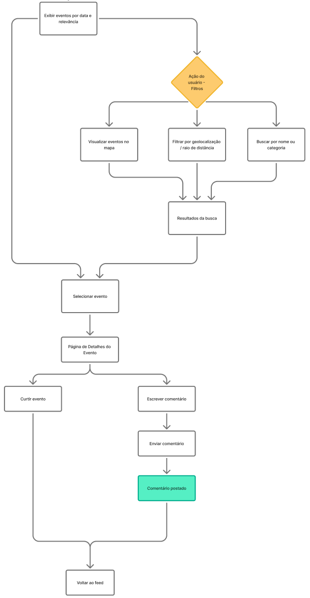

## Wireframes

### Login - versão mobile

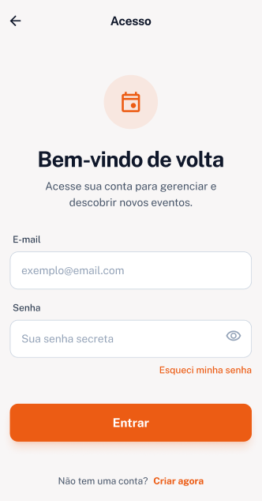

### Login - versão web

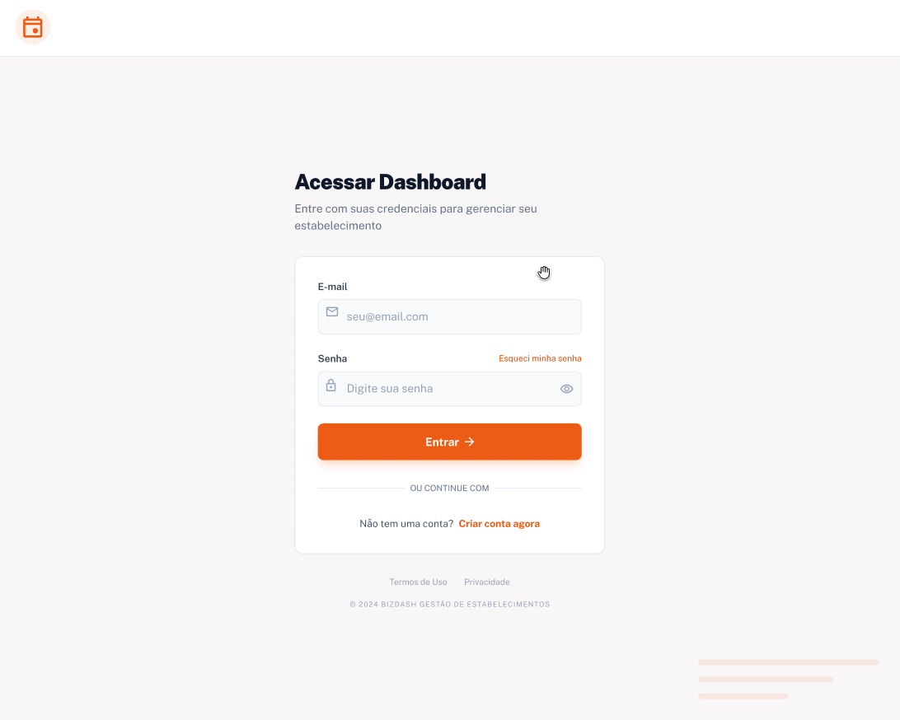

### Registro - versão mobile

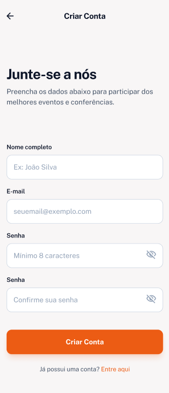

### Registro - versão web

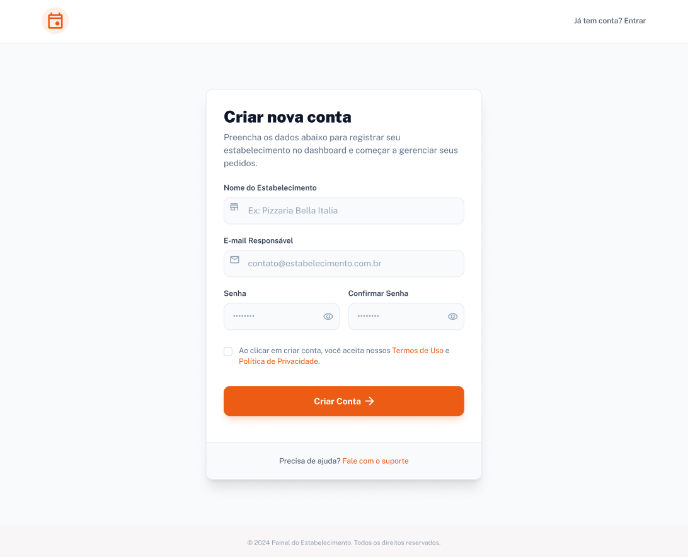

### Meu perfil - versão mobile
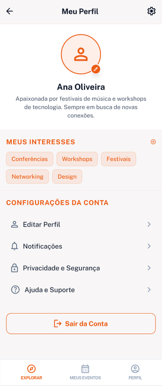

### Explorar (estilo lista) - versão mobile

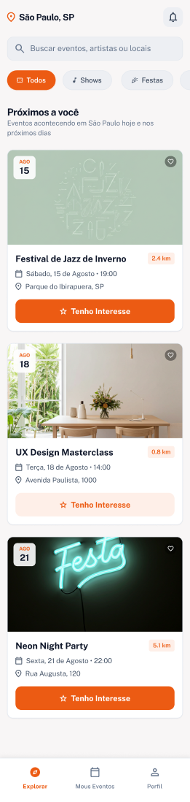

### Explorar (estilo mapa) - versão mobile

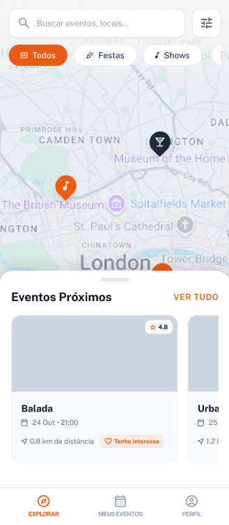

### Detalhes do evento - versão mobile

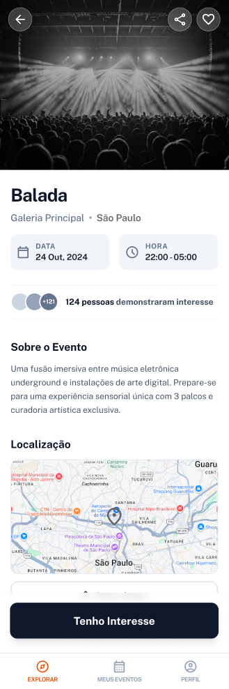

### Meus eventos - versão mobile

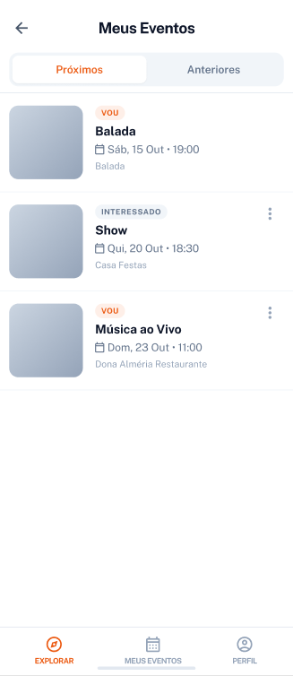

### Gerenciar eventos - versão web

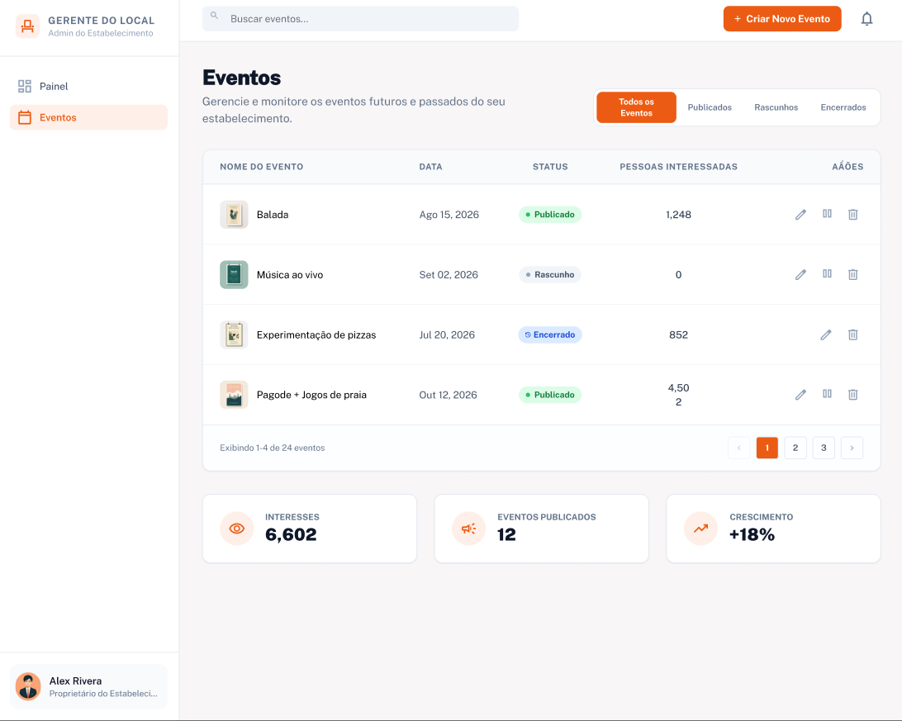

### Criar evento - versão web

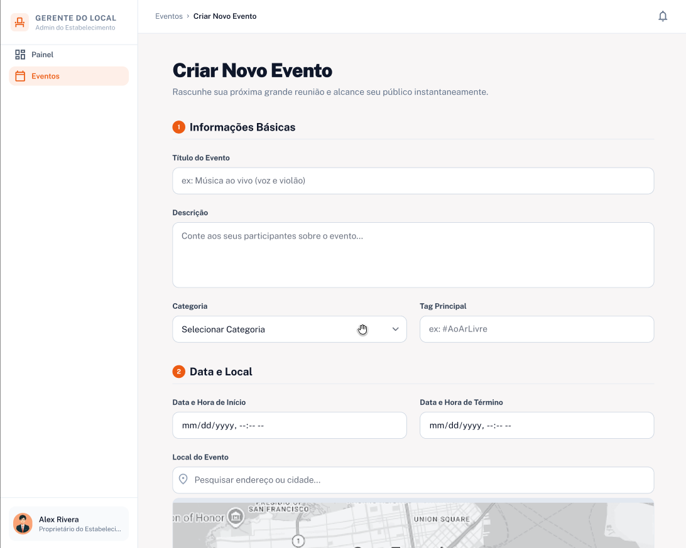
