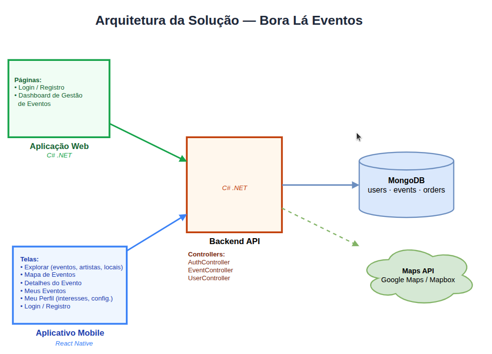
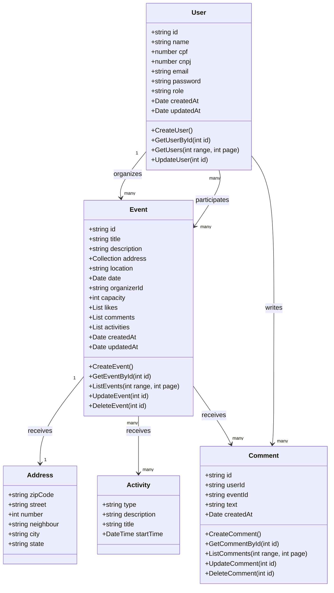

# Arquitetura da Solução

<span style="color:red">Pré-requisitos: <a href="3-Projeto de Interface.md"> Projeto de Interface</a></span>

Definição de como o software é estruturado em termos dos componentes que fazem parte da solução e do ambiente de hospedagem da aplicação.



## Diagrama de Classes

O diagrama de classes ilustra graficamente como será a estrutura do software, e como cada uma das classes da sua estrutura estarão interligadas. Essas classes servem de modelo para materializar os objetos que executarão na memória.



## Documentação do Banco de Dados MongoDB

Este documento descreve a estrutura e o esquema do banco de dados não relacional utilizado por nosso projeto, baseado em MongoDB. O MongoDB é um banco de dados NoSQL que armazena dados em documentos JSON (ou BSON, internamente), permitindo uma estrutura flexível e escalável para armazenar e consultar dados.

O banco de dados é composto por três coleções principais, derivadas do diagrama de classes da aplicação: **users**, **events** e **reviews**.

## Esquema do Banco de Dados

### Coleção: users
Armazena as informações dos usuários do sistema, incluindo frequentadores e organizadores de eventos.

Estrutura do Documento

```json
{
    "_id": "ObjectId('5f7e1bbf9b2a4f1a9c38b9a1')",
    "name": "John Doe",
    "document": "123.456.789-00",
    "email": "joao.silva@example.com",
    "passwordHash": "hash_da_senha",
    "role": "organizer",
    "createdAt": "2024-08-29T10:00:00Z",
    "updatedAt": "2024-08-29T12:00:00Z"
}
```

#### Descrição dos Campos

> - <strong>\_id:</strong> Identificador único do usuário gerado automaticamente pelo MongoDB.
> - <strong>name:</strong> Nome completo do usuário.
> - <strong>document:</strong> Documento de identificação do usuário (CPF ou CNPJ).
> - <strong>email:</strong> Endereço de e-mail do usuário, utilizado para login e recuperação de conta.
> - <strong>passwordHash:</strong> Hash da senha do usuário gerado com algoritmo de criptografia forte.
> - <strong>role:</strong> Papel do usuário na plataforma. Valores possíveis: `"user"` (frequentador), `"organizer"` (organizador de eventos), `"admin"` (administrador).
> - <strong>createdAt:</strong> Data e hora de criação do cadastro.
> - <strong>updatedAt:</strong> Data e hora da última atualização dos dados do usuário.

---

### Coleção: events
Armazena os eventos cadastrados pelos organizadores, incluindo localização, data e lista de participantes.

Estrutura do Documento

```json
{
    "_id": "ObjectId('5f7e2aaf9b2a4f1a9c38b9b1')",
    "title": "Show de Jazz no Boteco do Zé",
    "description": "Uma noite especial com jazz ao vivo e drinks exclusivos.",
    "address": {
        "street": "Rua das Flores",
        "number": 123,
        "neighborhood": "Centro",
        "city": "Belo Horizonte",
        "state": "MG",
        "zipCode": "30130-110"
    },
    "location": {
        "type": "Point",
        "coordinates": [-43.9387, -19.9167]
    },
    "date": "2024-09-15T20:00:00Z",
    "organizerId": "ObjectId('5f7e1bbf9b2a4f1a9c38b9a1')",
    "capacity": 100,
    "participants": [
        "ObjectId('5f7e1bbf9b2a4f1a9c38b9a2')",
        "ObjectId('5f7e1bbf9b2a4f1a9c38b9a3')"
    ],
    "createdAt": "2024-08-29T10:30:00Z",
    "updatedAt": "2024-08-29T11:30:00Z"
}
```

#### Descrição dos Campos
> - <strong>_id:</strong> Identificador único do evento gerado automaticamente pelo MongoDB.
> - <strong>title:</strong> Título do evento.
> - <strong>description:</strong> Descrição detalhada do evento.
> - <strong>address:</strong> Endereço completo do local do evento, contendo rua, bairro, cidade, estado e CEP.
> - <strong>location:</strong> Coordenadas geográficas no formato GeoJSON (`Point`), com longitude e latitude. Usado para busca por proximidade (RF-009, RF-010).
> - <strong>date:</strong> Data e hora de realização do evento.
> - <strong>organizerId:</strong> Referência ao `_id` do usuário organizador do evento.
> - <strong>capacity:</strong> Capacidade máxima de participantes do evento.
> - <strong>participants:</strong> Lista de `_id`s dos usuários que confirmaram participação no evento.
> - <strong>createdAt:</strong> Data e hora de criação do evento.
> - <strong>updatedAt:</strong> Data e hora da última atualização dos dados do evento.

---

### Coleção: reviews
Armazena as avaliações feitas pelos usuários nos eventos, contemplando curtidas (rating) e comentários (RF-007, RF-008).

Estrutura do Documento

```json
{
    "_id": "ObjectId('5f7e3ccf9b2a4f1a9c38b9c1')",
    "userId": "ObjectId('5f7e1bbf9b2a4f1a9c38b9a2')",
    "eventId": "ObjectId('5f7e2aaf9b2a4f1a9c38b9b1')",
    "rating": 5,
    "comment": "Evento incrível! A música estava ótima e o ambiente era aconchegante.",
    "createdAt": "2024-09-15T23:00:00Z"
}
```

#### Descrição dos Campos
> - <strong>_id:</strong> Identificador único da avaliação gerado automaticamente pelo MongoDB.
> - <strong>userId:</strong> Referência ao `_id` do usuário que escreveu a avaliação.
> - <strong>eventId:</strong> Referência ao `_id` do evento avaliado.
> - <strong>rating:</strong> Nota atribuída ao evento (de 1 a 5). Representa a funcionalidade de "curtir" do sistema.
> - <strong>comment:</strong> Comentário textual do usuário sobre o evento. Campo opcional.
> - <strong>createdAt:</strong> Data e hora em que a avaliação foi registrada.

### Boas Práticas

Validação de Dados: Implementar validação de esquema e restrições na aplicação para garantir a consistência dos dados.

Monitoramento e Logs: Utilize ferramentas de monitoramento e logging para acompanhar a saúde do banco de dados e diagnosticar problemas.

Escalabilidade: Considere estratégias de sharding e replicação para lidar com crescimento do banco de dados e alta disponibilidade.

### Material de Apoio da Etapa

Na etapa 2, em máterial de apoio, estão disponíveis vídeos com a configuração do mongo.db e a utilização com Bson no C#

## Modelo ER (Somente se tiver mais de um banco e outro for relacional)

O Modelo ER representa através de um diagrama como as entidades (coisas, objetos) se relacionam entre si na aplicação interativa.

As referências abaixo irão auxiliá-lo na geração do artefato “Modelo ER”.

> - [Como fazer um diagrama entidade relacionamento | Lucidchart](https://www.lucidchart.com/pages/pt/como-fazer-um-diagrama-entidade-relacionamento)

## Esquema Relacional (Somente se tiver mais de um banco e outro for relacional)

O Esquema Relacional corresponde à representação dos dados em tabelas juntamente com as restrições de integridade e chave primária.

As referências abaixo irão auxiliá-lo na geração do artefato “Esquema Relacional”.

> - [Criando um modelo relacional - Documentação da IBM](https://www.ibm.com/docs/pt-br/cognos-analytics/10.2.2?topic=designer-creating-relational-model)

## Modelo Físico (Somente se tiver mais de um banco e outro for relacional)

Entregar um arquivo banco.sql contendo os scripts de criação das tabelas do banco de dados. Este arquivo deverá ser incluído dentro da pasta src\bd.

## Tecnologias Utilizadas

Descreva aqui qual(is) tecnologias você vai usar para resolver o seu problema, ou seja, implementar a sua solução. Liste todas as tecnologias envolvidas, linguagens a serem utilizadas, serviços web, frameworks, bibliotecas, IDEs de desenvolvimento, e ferramentas.

Apresente também uma figura explicando como as tecnologias estão relacionadas ou como uma interação do usuário com o sistema vai ser conduzida, por onde ela passa até retornar uma resposta ao usuário.

## Hospedagem

Explique como a hospedagem e o lançamento da plataforma foi feita.

> **Links Úteis**:
>
> - [Website com GitHub Pages](https://pages.github.com/)
> - [Programação colaborativa com Repl.it](https://repl.it/)
> - [Getting Started with Heroku](https://devcenter.heroku.com/start)
> - [Publicando Seu Site No Heroku](http://pythonclub.com.br/publicando-seu-hello-world-no-heroku.html)

## Qualidade de Software

Conceituar qualidade de fato é uma tarefa complexa, mas ela pode ser vista como um método gerencial que através de procedimentos disseminados por toda a organização, busca garantir um produto final que satisfaça às expectativas dos stakeholders.

No contexto de desenvolvimento de software, qualidade pode ser entendida como um conjunto de características a serem satisfeitas, de modo que o produto de software atenda às necessidades de seus usuários. Entretanto, tal nível de satisfação nem sempre é alcançado de forma espontânea, devendo ser continuamente construído. Assim, a qualidade do produto depende fortemente do seu respectivo processo de desenvolvimento.

A norma internacional ISO/IEC 25010, que é uma atualização da ISO/IEC 9126, define oito características e 30 subcaracterísticas de qualidade para produtos de software.
Com base nessas características e nas respectivas sub-características, identifique as sub-características que sua equipe utilizará como base para nortear o desenvolvimento do projeto de software considerando-se alguns aspectos simples de qualidade. Justifique as subcaracterísticas escolhidas pelo time e elenque as métricas que permitirão a equipe avaliar os objetos de interesse.

> **Links Úteis**:
>
> - [ISO/IEC 25010:2011 - Systems and software engineering — Systems and software Quality Requirements and Evaluation (SQuaRE) — System and software quality models](https://www.iso.org/standard/35733.html/)
> - [Análise sobre a ISO 9126 – NBR 13596](https://www.tiespecialistas.com.br/analise-sobre-iso-9126-nbr-13596/)
> - [Qualidade de Software - Engenharia de Software 29](https://www.devmedia.com.br/qualidade-de-software-engenharia-de-software-29/18209/)
